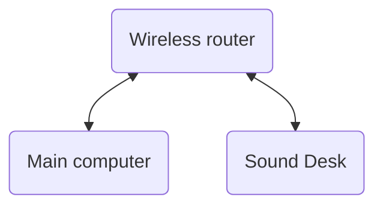

# Network Setup

## Architecture



## Setup computer

Connect the to the `wireless router` wireless network.

## Setup sound desk

1. Connect to the soundcraft
    1. Use a LAN cable is preferred
    1. Use the wireless hotspot if configured, but be aware we will lose connectivity during setup.
1. Open the web interface [http://ui-mixer.io](http://ui-mixer.io)
1. Open up soundcraft UI
1. Click on the settings icon, the `cog` icon in the top middle. We may need out admin password.
1. Click on the `network` tab
1. Select `Wi-Fi configurtation` tab, and enter the following settings. If we can choose to enable the wifi after entering the settings do that.
    ```md
    SSID: enter the SSDI (wifi name) of the woreless router
    Password: for the wirless network
    Address: choose DHCP
    WiFi: set to enabled
    ```
1. Power cycle the mixer to apply settings
1. Go to [http://ui-mixer.io](http://ui-mixer.io) in your browser


### Troubleshooting

1. I have lost access to soundcraft
    - Connect with a laptop via lan cable and check the wifi settings

### Resources

- [Soundcraft UI manual](https://www.soundcraft.com/en/product_documents/ui24r_manual_v1-0_web-pdf)
